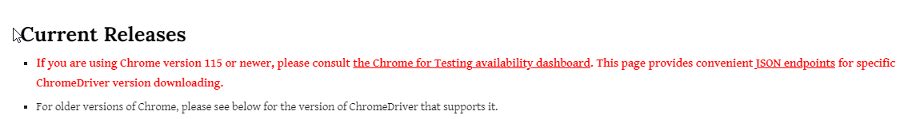
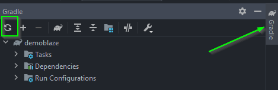

# Proyecto automatizacion portal Swag Labs

  
  
  
   

Pre-requisitos
- Mozilla firefox
- JDK version 1.8.0
- Gradle 7.4
- Entorno de desarrollo IntelliJ IDEA
- Git

nota: debido a que el driver de chrome a la fecha solo esta disponible para versiones anteriores a la 114, la ejecucion solo funciona para el navegador mozilla firefox

repositorio de los drivers para chrome https://chromedriver.chromium.org/downloads

Estructura del proyecto
- features: en esta carpeta se encuentra redactado los casos de prueba en lenguaje gherkin
- stepsdefinitons: en esta carpeta se encuentra el paso a paso de los features que se utiliza para asociarlos a los archivos feature
- page: se encuentra toda la logica de programacion utilizada por los casos de prueba
- runner: clase la cual se utiliza para ejecutar los casos de prueba
- utils: configuracion del driver correspondiente al navegador donde se ejecutaran las pruebas

Instrucciones de ejecucion
1. Clonar el proyecto del repositorio https://github.com/jhonsb77/saucedemo.git mediante el comando git clone en la carpeta deseada de su equipo
2. En el etorno de desarrrollo, seleccionar la opcion "File" y posteriormente la opcion "Open". Alli seleccionara el proyecto guardado en la ruta del paso anterior
3. Esperar a que el proyecto se configure y descargue las dependecias, si esto no se realiza, en el archivo "build.gradle" seleccionar la opcion "reload all gradle projects"
   
4. Seleccionar el archivo runner, dar click derecho y seleccionar la opcion "Run"
5. Al finalizar la ejecucion los reportes de la misma se podran visualizar en el archivo index.html ubicado en la ruta: saucedemo\target\site\serenity
